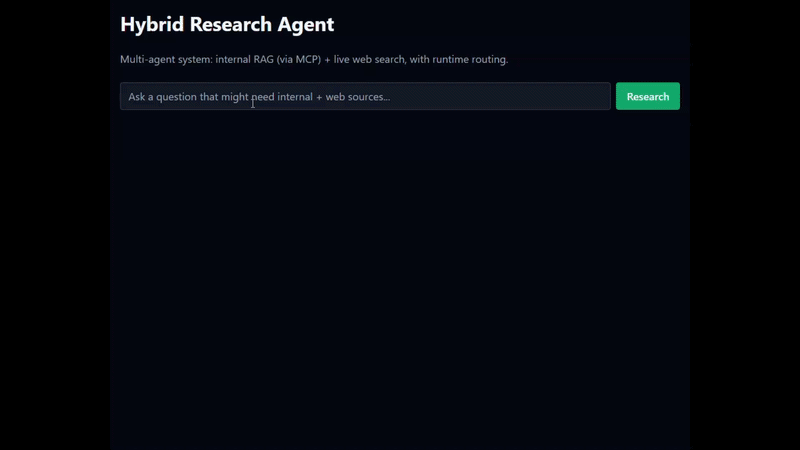
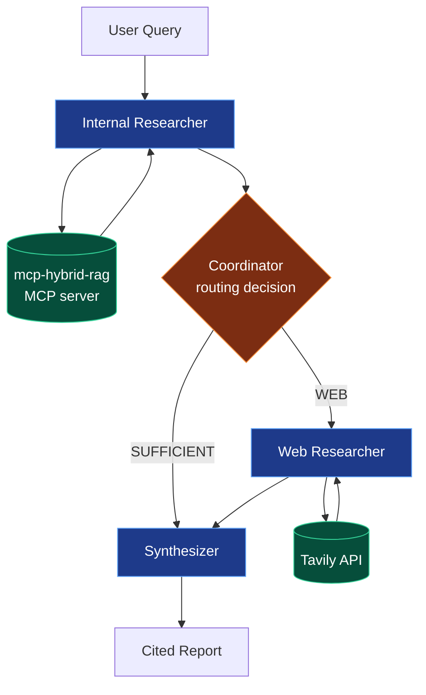

# Hybrid Research Agent

A multi-agent system that combines **internal RAG** (via an MCP server) with **live web search**. A coordinator agent decides at runtime whether the internal corpus is sufficient or whether the web is needed.



## What This Does

Given a natural-language question, the agent decides where to look — and it makes that decision **at runtime based on the results it sees**, not a scripted pipeline.

Two examples:

| Query | Routing decision | Why |
|---|---|---|
| *"What was Apple's total net sales in 2023?"* | **SUFFICIENT** | The answer is in the SEC 10-K filings; the web isn't needed |
| *"What is Apple's current stock price?"* | **WEB** | SEC filings only contain historical data; live data requires web search |

That's the multi-agent behavior: **the coordinator chooses the flow based on observed state.**

## Architecture



**Flow:** the coordinator observes the internal retrieval results and decides whether they answer the question. If they do, it goes straight to synthesis. If not, it invokes the web researcher. The path is decided at runtime, not hardcoded.

## Why Multi-Agent (Not Just a Pipeline)

A pipeline would be: *parse → search internal → search web → synthesize*. Always the same path.

This system is different: the **router reads the internal results and decides**. If the internal chunks already answer the question, the web researcher never runs. That's the difference between an agentic workflow and a scripted flow — and it's the reason the routing trace exists.

## Evaluation: Routing Accuracy

20 hand-labeled queries (10 internal-answerable, 10 web-required) evaluated for routing correctness.

**Result: 18/20 = 90%**

Two misses, both instructive:

- **"What was Microsoft's operating income in fiscal 2023?"** — expected `SUFFICIENT`, routed `WEB`. The internal retriever returned adjacent chunks (income statement context, MD&A narrative) but not the specific line item. The router correctly concluded the corpus didn't answer the question — a retrieval miss, not a routing miss.

- **"Who is the current CEO of Microsoft?"** — expected `WEB`, routed `SUFFICIENT`. Satya Nadella is named in the 2023 filing, and the internal retriever surfaced it. The router's decision was defensible — the corpus *does* contain the answer — but the "current" framing in the query made the expected label `WEB`. This is a genuinely ambiguous query.

Both misses illustrate the same point: **the router is only as good as the retrieval it's given.** When the internal corpus contains the answer, the router routes to it. When it doesn't, the router falls back to web.

Full results:
- [`results/routing_eval_2026-10-05.txt`](results/routing_eval_2026-10-05.txt)
- [`results/routing_eval_2026-10-05.json`](results/routing_eval_2026-10-05.json)

## Stack

| Layer | Technology |
|---|---|
| **Agent orchestration** | LangGraph (StateGraph with conditional edges) |
| **LLM** | Any OpenAI-compatible endpoint (local server or hosted) |
| **Internal RAG** | [mcp-hybrid-rag](https://github.com/HOORIAGABA/mcp-hybrid-rag) — BM25 + BGE + RRF + cross-encoder reranking, exposed as an MCP server |
| **MCP transport** | Streamable HTTP |
| **Web search** | Tavily API |
| **Backend** | FastAPI |
| **Frontend** | Next.js 14, React 18, Tailwind CSS |
| **Evaluation** | Hand-labeled routing golden set (20 queries) |

## Related Project

This agent consumes [**mcp-hybrid-rag**](https://github.com/HOORIAGABA/mcp-hybrid-rag) — a hybrid retrieval engine over SEC 10-K filings. That project exposes `search_financial_docs` as an MCP tool. This project uses it as the internal researcher.

## Prerequisites

You need **two services running** for the agent to work:

1. **The `mcp-hybrid-rag` MCP server** on port 8765 (HTTP mode)
2. **An OpenAI-compatible LLM endpoint** — either a local server or a hosted API

### Start the MCP server

In its own terminal:

```bash
cd path/to/mcp-hybrid-rag
python -m venv .venv
.venv\Scripts\Activate.ps1     # Windows
pip install -r requirements.txt
python -m src.mcp_server.server --http
```

Wait for `Models ready.` before starting the agent. The first run loads two BGE models (~2.3GB) and takes 1–2 minutes.

The server will be available at `http://127.0.0.1:8765/mcp`.

## Setup

```bash
python -m venv .venv
.venv\Scripts\Activate.ps1     # Windows
pip install -r requirements.txt
copy .env.example .env
```

Edit `.env`:

```
# LLM — any OpenAI-compatible endpoint
LLM_API_KEY=your-key-here
LLM_BASE_URL=http://localhost:20128/v1
LLM_MODEL=your-model-name

# Tavily web search
TAVILY_API_KEY=tvly-...

# MCP server URL
MCP_HYBRID_RAG_URL=http://127.0.0.1:8765/mcp
```

## Run

### Backend

```bash
uvicorn src.api.main:app --reload
```

### Frontend

In a new terminal:

```bash
cd frontend
npm install
copy .env.local.example .env.local
npm run dev
```

Open `http://localhost:3000` and try:

- `What was Apple's total net sales in 2023?` → routes to **SUFFICIENT**
- `What is Apple's current stock price?` → routes to **WEB**

The UI shows the routing trace, the decision, the synthesized report, and the sources used.

### CLI

```bash
python -m scripts.run_research "What was Apple's total net sales in 2023?"
```

## Evaluation

With the MCP server running:

```bash
python -m src.evaluation.evaluate
```

Output is written to `results/routing_eval_<date>.txt` and `.json`.

## Project Structure

```
hybrid-research-agent/
├── src/
│   ├── agents/            Coordinator, Internal, Web, Synthesizer
│   ├── graph/             LangGraph state + builder
│   ├── mcp_client/        HTTP MCP client for mcp-hybrid-rag
│   ├── tools/             LLM + Tavily wrappers
│   ├── api/               FastAPI backend
│   └── evaluation/        Golden queries + evaluator
├── frontend/              Next.js UI with routing trace
├── scripts/               CLI runner
├── tests/                 Unit tests (mock LLM)
├── docs/                  Demo GIF and architecture notes
└── results/               Evaluation outputs
```

## Why Streamable HTTP (Not stdio)

MCP supports two transports: **stdio** (client spawns the server as a subprocess) and **Streamable HTTP** (server runs independently, client connects over HTTP).

This project uses HTTP because:

1. **Windows subprocess deadlock.** `sentence-transformers` deadlocks when loading models in a subprocess whose stdout is piped. This is a known issue on Windows and can't be fixed from the client side.
2. **Decoupled lifecycle.** The server can be shared across multiple clients and run on a different machine than the agent.
3. **Production-ready.** Real MCP deployments use HTTP transport, not stdio subprocess spawning.

The `mcp-hybrid-rag` server still supports stdio for the MCP Inspector and Claude Desktop. The `--http` flag enables HTTP mode.

## License

MIT — see [LICENSE](LICENSE).